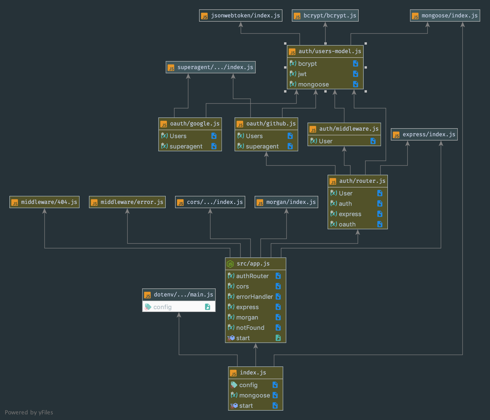

# LAB - 09

 ## API Server

 ### Author: Lillian Gales & Evan Brecht-Curry

 ### Links and Resources
* [submission Front End](https://github.com/evan-401-advanced-javascript/lab12-frontEnd)
* [submission Back End](https://github.com/evan-401-advanced-javascript/lab12-OAuth)
* [front-end](https://lab12-front.herokuapp.com/) 
* [back-end](https://lab12-oauth.herokuapp.com/)
* [docs](http://localhost:3000/docs/)

### Setup
#### `.env` requirements
* `back end PORT` - 3000
* `front end PORT` - 8080

 #### UML
